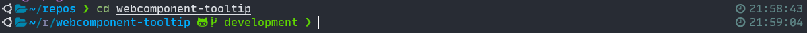

# Recursive Mono Linear Nerd Font
Patched versions of Recursive Mono font with Nerd Fonts glyphs. 

It contains all glyphs from the [Nerd Fonts](https://github.com/ryanoasis/nerd-fonts) including powerline symbols, fontawesome icons and others.
Built with [Nerd Fonts Patcher](https://github.com/ryanoasis/nerd-fonts#font-patcher)

## Installation
1. Clone repository (get .ttf files)
2. Install font on your system, it will be available as `RecMonoLinear Nerd Font`

Windows Terminal screenshot

